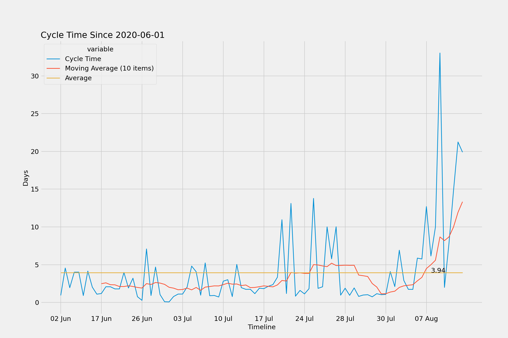
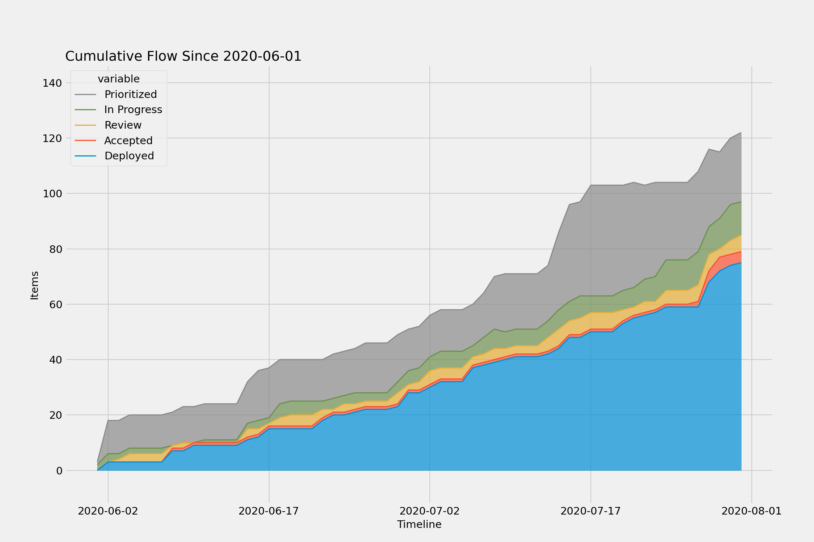
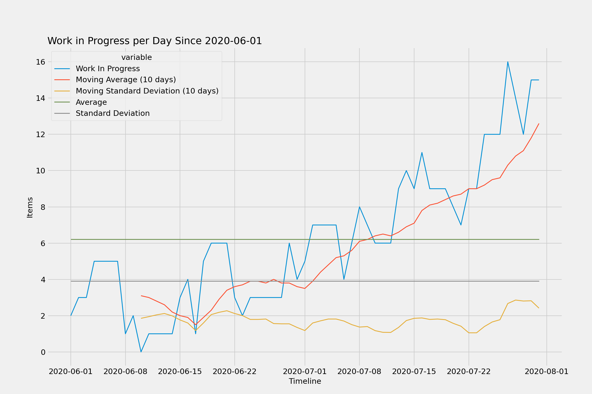
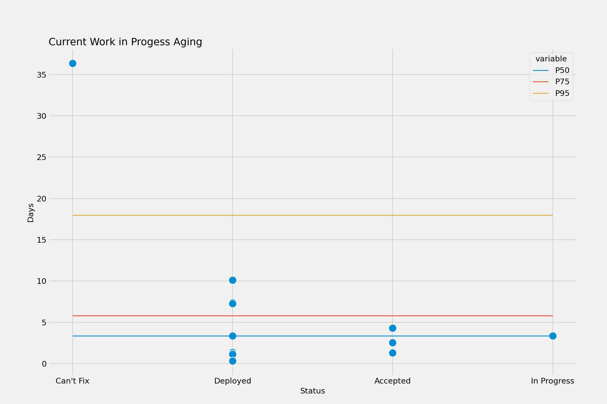

# Kanban Metrics

This is an experimental [Jupyter notebook](kanban.ipynb) and [command line](jira.py) [tools](analysis.py) using Jira issue changelogs to:

1. load a historical record of a Kanban
2. summarize key Kanban metrics
2. graph those key Kanban metrics (cycletime, throughput, flow, etc)
3. use these metrics to run a Kaplan-Meier survivability model and a Monte Carlo simulations

This allows us to use data forecasting (instead of gut estimation) to gauge:

* how likely will a single issue be completed in N days
* how much work a team can take on over the next N days
* and by what date N number of work items could be completed


## Setup

```
pip install -r requirements.txt
```

## Fetching Data from Jira

```
python jira.py [project_key] [since_date]
```

## Analyzing Data from the Command Line

```
python analysis.py -f data/data.csv summary
```

## Analyzing Data from Jupyter

```
jupyter lab
```

## Examples:

Generated from an example Jira project and data loaded from [example.csv](data/example.csv) on 2020-08-25 covering the previous 90 days:
       









